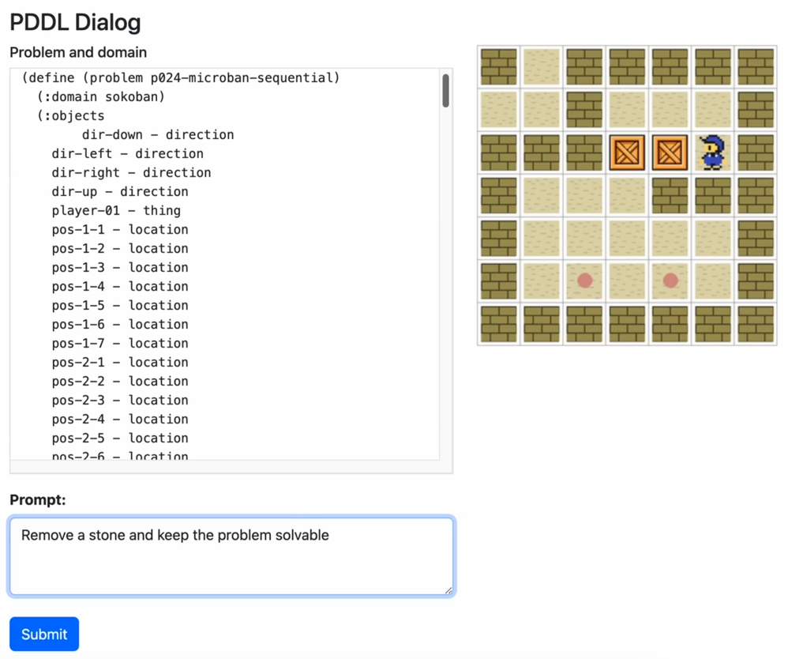

# PDDL Dialog
A web page (and backend) to ask ChatGPT about a given PDDL and run it's answers.

1. Forked from [PDDLGym](https://github.com/tomsilver/pddlgym)
2. Added [Flask ChatGPT client](https://www.geeksforgeeks.org/implement-chatgpt-in-a-flask-application/)

# How to run
1. Install just like [PDDLGym](https://github.com/tomsilver/pddlgym)
2. Set your OpenAI API key
3. Run `background_simulator.py`
4. Run `server.py`
5. Open [`http://127.0.0.1:5000/simulation`](http://127.0.0.1:5000/simulation)